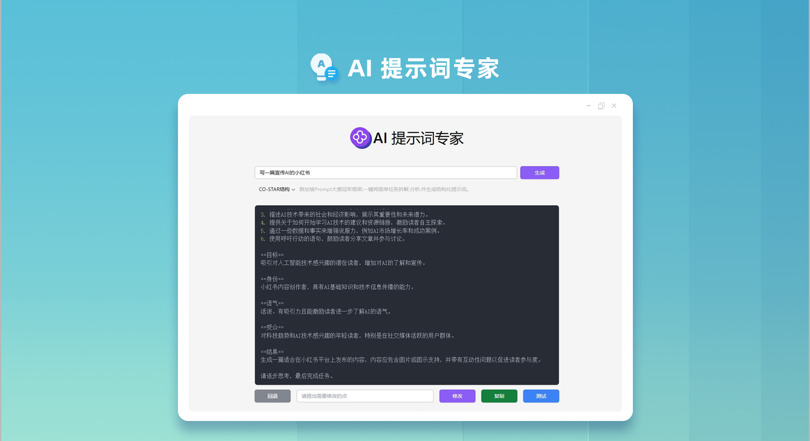
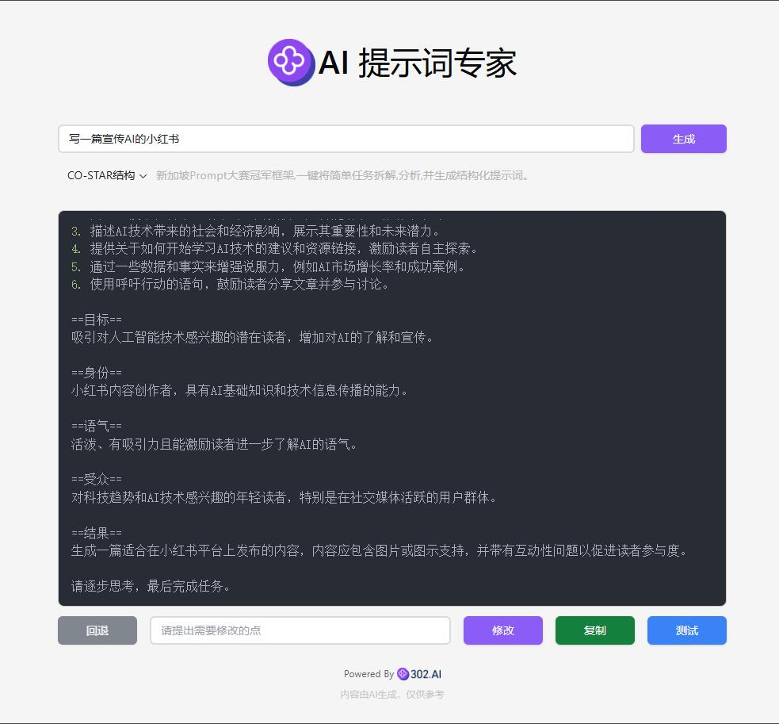

# <p align="center">🤖  AI 提示词专家 🚀✨</p>

<p align="center">AI提示词专家将用户简单的提示语改写成高质量的CO-STAR、CRISPE、QStar(Q*)、变分法、Meta Prompting、CoT思维链、微软优化法和RISE结构的提示语，并且可以在线修改和测试，还提供对文字生成图片的提示语优化，可一键转换为高质量的英文提示语。</p>

<p align="center"><a href="https://302.ai/product/detail/24" target="blank"></a></p >

<p align="center"><a href="README.md">中文</a> | <a href="README_en.md">English</a> | <a href="README_ja.md">日本語</a></p>



来自[302.AI](https://302.ai)的[AI 提示词专家](https://302.ai/product/detail/24)的开源版本。你可以直接登录302.AI，零代码零配置使用在线版本。或者对本项目根据自己的需求进行修改并自行部署，通过服务端环境变量配置 API Key（详见「开发&部署」），浏览器无需再填写任何密钥。

## 界面预览
输入简单的描述，AI会生成高质量的提示语，有多种结构可供选择。支持在线修改和测试提示语。


## 项目特性
### 🛠️ 多种优化方案
支持12种不同的提示词优化方案，提供自定义优化框架的能力。

### 🎯 经典优化框架
- C0-STAR结构:系统性的提示词组织方法
- CRISPE结构:全方位的内容生成框架
- Chain of Thought(coT):通过思维链提升输出质量
### 🎯 专业创作优化
- DRAW：专业的AI绘画提示词优化
- RISE：结构化的提示词增强系统
- O1-STYLE：风格化创作提示词方案
### 🎯 高级优化技术
- Meta Prompting：元提示词优化
- VARI：变分法优化
- Q*：智能提示词优化算法
### 🎯 主流AI平台适配
- OpenAI优化法：适配GPT系列模型
- laude优化法：适配Anthropic模型
- 微软优化法：适配Azure AI服务
### 🌍 多语言支持
- 中文界面
- English Interface
- 日本語インターフェース

通过 AI 提示词专家，将您的创意转化为完美的AI指令! 🎉💻 让我们一起探索AI驱动的代码新世界吧! 🌟🚀

## 🚩 未来更新计划
- [ ] 行业细分提示词优化
- [ ] 更新新兴模型
- [ ] 增加对法语、德语、西班牙语等语言的转换功能

## 技术栈
- React
- Tailwind CSS
- Radix UI

## 开发&部署

### 安全架构说明
本应用为**前端 SPA + 服务端 BFF** 架构，已彻底移除「前端持有 API Key」的旧模型：
- 真实上游 AI 网关的 API Key 由**服务端**环境变量 `UPSTREAM_API_KEY` 持有并注入，前端零密钥；
- 前端不再直连外部 AI 网关，AI 调用统一请求同源 `/api/proxy/*`，由服务端代理转发；
- 前端通过 `/api/session` 建立**短期会话**（HttpOnly Cookie + 签名 Token），会话仅存于浏览器堆内存，绝不写入 `localStorage`；
- 代码中不存在任何静态密钥常量，VITE_* 变量不得承载任何密钥。
- 会话令牌与**设备指纹**绑定（Session Key 每次建会动态轮换，续期/代理请求须指纹一致），服务端 HMAC 签名，前端无法伪造或解密其它会话；
- 前端唯一的内联注入点（错误横幅）已收敛为**上下文输出编码**的白名单渲染，并对静态页与 `/api` 响应施加 **CSP**（禁内联/外域脚本、禁对象嵌入），纵深防御 XSS。

### 方式一：本地开发
1. 克隆项目 `git clone https://github.com/302ai/302_prompt_generator`
2. 安装依赖 `pnpm install`
3. 配置服务端环境（新建 `.env`，按 `.env.example` 填写 `UPSTREAM_API_KEY` / `SESSION_SECRET` 等）
4. 启动后端 BFF：`node server/index.js`
5. 启动前端：`pnpm dev`
6. 访问 http://localhost:5173（首次 AI 调用会自动建立会话，无需在浏览器填写 API Key）

> 说明：若仅使用本地前端直连调试，可结合 vite 的 `/api` 代理指向已启动的 `server/index.js`。

### 方式二：Docker 部署

#### 使用 Makefile（推荐）
```bash
# 构建镜像
make build

# 启动容器
make run

# 查看日志
make logs

# 停止容器
make stop

# 清理
make clean

# 查看所有命令
make help
```

#### 使用 Docker Compose
1. 复制环境变量配置 `cp .env.example .env`
2. 在 `.env` 中填写**服务端密钥**：`UPSTREAM_API_KEY=<你的 302.AI API Key>`、`SESSION_SECRET=<随机强口令>`
3. 启动服务 `docker-compose up -d`
4. 访问 http://localhost:3000（无需在浏览器填写 API Key）

#### 使用 Docker 命令
```bash
# 构建镜像
docker build -t 302-prompt-generator:latest .

# 运行容器（务必注入服务端密钥）
docker run -d -p 3000:80 \
  -e NODE_ENV=production \
  -e UPSTREAM_API_URL=https://api.302.ai \
  -e UPSTREAM_API_KEY=<你的 302.AI API Key> \
  -e SESSION_SECRET=<随机强口令> \
  --name 302-prompt-generator 302-prompt-generator:latest
```

### 环境变量说明

#### 前端构建变量（非敏感）
| 变量 | 说明 | 默认值 |
|------|------|--------|
| VITE_APP_MODEL_NAME | AI 模型名称 | gpt-4o |
| VITE_APP_REGION | 区域（0:中国, 1:全球） | 0 |
| VITE_APP_LOCALE | 语言（zh/en/ja） | zh |
| PORT | nginx 对外端口 | 3000 |

#### 服务端 BFF 变量（仅后端读取，严禁携带 VITE_ 前缀）
| 变量 | 说明 | 默认值 |
|------|------|--------|
| NODE_ENV | 运行模式（容器应置 `production`；会话 Cookie 默认即带 Secure） | production |
| UPSTREAM_API_URL | 上游 AI 网关地址（默认仅允许 https，避免 API Key 明文外发） | https://api.302.ai |
| UPSTREAM_API_KEY | **真实上游 API Key（服务端唯一持有）** | 空 |
| SESSION_SECRET | 短期会话签名密钥（建议 `openssl rand -hex 32`） | 空 |
| SERVER_PORT | BFF 内部监听端口 | 3001 |
| RATE_LIMIT_SESSION_MAX | 会话建立限流（单 IP 每分钟上限） | 10 |
| RATE_LIMIT_REFRESH_MAX | 会话续期限流（单 IP 每分钟上限） | 20 |
| RATE_LIMIT_PROXY_MAX | 代理调用限流（单 IP 每分钟上限） | 30 |
| PROXY_MAX_CONCURRENT | 代理并发上限 | 5 |
| PROXY_MAX_BODY_BYTES | 代理请求体大小上限（字节） | 5242880 |
