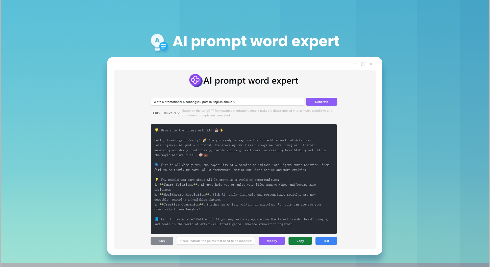
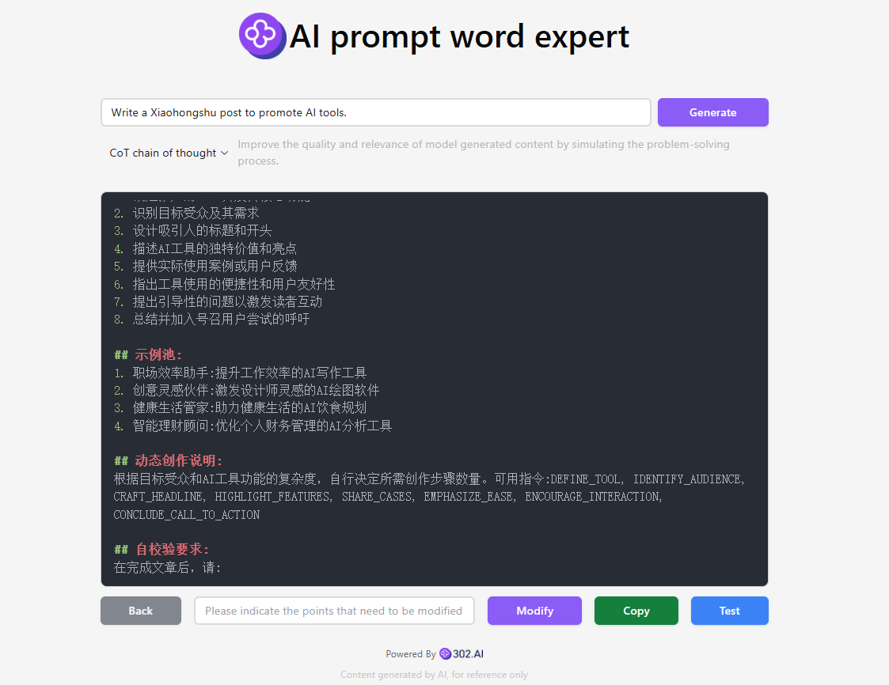

# <p align="center">🤖 AI Prompt Expert 🚀✨</p>

<p align="center">The AI prompt expert rewrites users' simple prompts into high-quality prompts in the structures of CO-STAR, CRISPE, QStar (Q*), the variational method, Meta Prompting, Chain of Thought (CoT), Microsoft's optimization method and RISE. Moreover, it allows for online modification and testing. It also provides optimization for prompts used for generating images from text and can convert them into high-quality English prompts with just one click.</p>

<p align="center"><a href="https://302.ai/product/detail/24" target="blank"></a></p >

<p align="center"><a href="README.md">中文</a> | <a href="README_en.md">English</a> | <a href="README_ja.md">日本語</a></p>



The open-source version of [AI Prompt Expert](https://302.ai/product/detail/24) from [302.AI](https://302.ai/en/).
You can directly log in to 302.AI to use the online version with zero code and zero configuration.
Or modify this project according to your needs and deploy it yourself; configure the API Key via server-side environment variables (see "Development & Deployment"). No key entry is needed in the browser.

## Interface Preview
Enter a simple description, and the AI will generate high-quality prompts. There are multiple structures available for selection. It supports online modification and testing of prompts.



## Project Features
### 🛠️ Multiple optimization solutions
 It supports 12 different prompt optimization solutions and provides the ability to customize the optimization framework.
### 🎯 Classic Optimization Frameworks
- CO-STAR structure: Systematic prompt organization method
- CRISPE structure: Comprehensive content generation framework
- Chain of Thought (CoT): Improve output quality through thought chains
### 🎯 Professional Creation Optimization
- DRAW: Professional AI drawing prompt optimization
- RISE: Structured prompt enhancement system
- O1-STYLE: Stylized creation prompt solution
### 🎯 Advanced Optimization Techniques
- Meta Prompting: Meta prompt optimization
- VARI: Variational optimization
- Q*: Intelligent prompt optimization algorithm
### 🎯 Mainstream AI Platform Adaptation
- OpenAI optimization: Adapted for GPT series models
- Claude optimization: Adapted for Anthropic models
- Microsoft optimization: Adapted for Azure AI services
### 🌍 Multi-language Support
- Chinese Interface
- English Interface
- Japanese Interface


Through AI Prompt Expert! - Transform your ideas into perfect AI instructions! 🎉💻 Let's explore the new world of AI-driven code together! 🌟🚀

## 🚩 Future Update Plans
- [ ] Industry Segmentation Prompt Optimization
- [ ] Update Emerging Models
- [ ] Add Conversion Functions for Languages such as French, German, Spanish

## Tech Stack
- React
- Tailwind CSS
- Radix UI
## Development & Deployment

### Security Architecture
This app uses a **front-end SPA + server-side BFF** architecture. The legacy model of the front-end holding API Keys has been fully removed:
- The real upstream AI gateway API Key is held and injected **server-side** via the `UPSTREAM_API_KEY` environment variable; the browser carries zero keys;
- The front-end no longer calls the external AI gateway directly; all AI calls hit the same-origin `/api/proxy/*` and are forwarded by the server;
- The front-end establishes a **short-lived session** via `/api/session` (HttpOnly Cookie + signed token). The token lives only in browser heap memory and is **never** written to `localStorage`;
- No static key constant exists in the codebase, and `VITE_*` variables must never carry any secret.
- The session token is **bound to the device fingerprint** (a fresh Session Key is rolled on each session creation; refresh/proxy requests must match the bound fingerprint). Tokens are HMAC-signed server-side, so the front end cannot forge or decrypt other sessions;
- The only inline-injection surface on the front end (the error banner) has been converged to a **context-aware, output-encoded** allow-listed renderer, and **CSP** (no inline/external scripts, no object embedding) is enforced on both the static pages and the `/api` responses for layered XSS defense.

### Method 1: Local Development
1. Clone the project `git clone https://github.com/302ai/302_prompt_generator`
2. Install dependencies `pnpm install`
3. Configure the server environment (create `.env` from `.env.example` and fill in `UPSTREAM_API_KEY` / `SESSION_SECRET`, etc.)
4. Start the backend BFF: `node server/index.js`
5. Start the front-end: `pnpm dev`
6. Visit http://localhost:5173 (a session is established automatically on the first AI call; no need to enter an API Key in the browser)

### Method 2: Docker Deployment

#### Using Makefile (Recommended)
```bash
# Build image
make build

# Start container
make run

# View logs
make logs

# Stop container
make stop

# Clean
make clean

# List all commands
make help
```

#### Using Docker Compose
1. Copy the env config `cp .env.example .env`
2. Fill in the **server-side keys** in `.env`: `UPSTREAM_API_KEY=<your 302.AI API Key>`, `SESSION_SECRET=<random strong secret>`
3. Start the service `docker-compose up -d`
4. Visit http://localhost:3000 (no API Key entry needed in the browser)

#### Using Docker Commands
```bash
# Build image
docker build -t 302-prompt-generator:latest .

# Run container (be sure to inject the server-side keys)
docker run -d -p 3000:80 \
  -e NODE_ENV=production \
  -e UPSTREAM_API_URL=https://api.302.ai \
  -e UPSTREAM_API_KEY=<your 302.AI API Key> \
  -e SESSION_SECRET=<random strong secret> \
  --name 302-prompt-generator 302-prompt-generator:latest
```

### Environment Variables

#### Front-end Build Variables (non-sensitive)
| Variable | Description | Default |
|----------|-------------|---------|
| VITE_APP_MODEL_NAME | AI model name | gpt-4o |
| VITE_APP_REGION | Region (0: China, 1: Global) | 0 |
| VITE_APP_LOCALE | Language (zh/en/ja) | zh |
| PORT | nginx public port | 3000 |

#### Server-side BFF Variables (read by the backend only; never prefix with VITE_)
| Variable | Description | Default |
|----------|-------------|---------|
| NODE_ENV | Runtime mode (set `production` in the container; the session cookie carries Secure by default) | production |
| UPSTREAM_API_URL | Upstream AI gateway URL (only https is allowed by default, to avoid leaking the API Key in plaintext) | https://api.302.ai |
| UPSTREAM_API_KEY | **Real upstream API Key (held only by the server)** | empty |
| SESSION_SECRET | Session signing secret (suggest `openssl rand -hex 32`) | empty |
| SERVER_PORT | BFF internal listen port | 3001 |
| RATE_LIMIT_SESSION_MAX | Session creation rate limit (per-IP per-minute) | 10 |
| RATE_LIMIT_REFRESH_MAX | Session refresh rate limit (per-IP per-minute) | 20 |
| RATE_LIMIT_PROXY_MAX | Proxy call rate limit (per-IP per-minute) | 30 |
| PROXY_MAX_CONCURRENT | Max concurrent upstream proxy requests | 5 |
| PROXY_MAX_BODY_BYTES | Max proxy request body size (bytes) | 5242880 |
