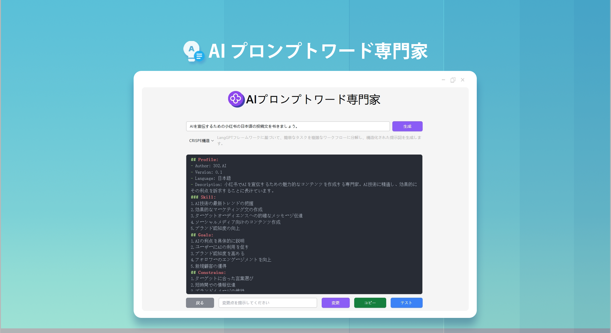
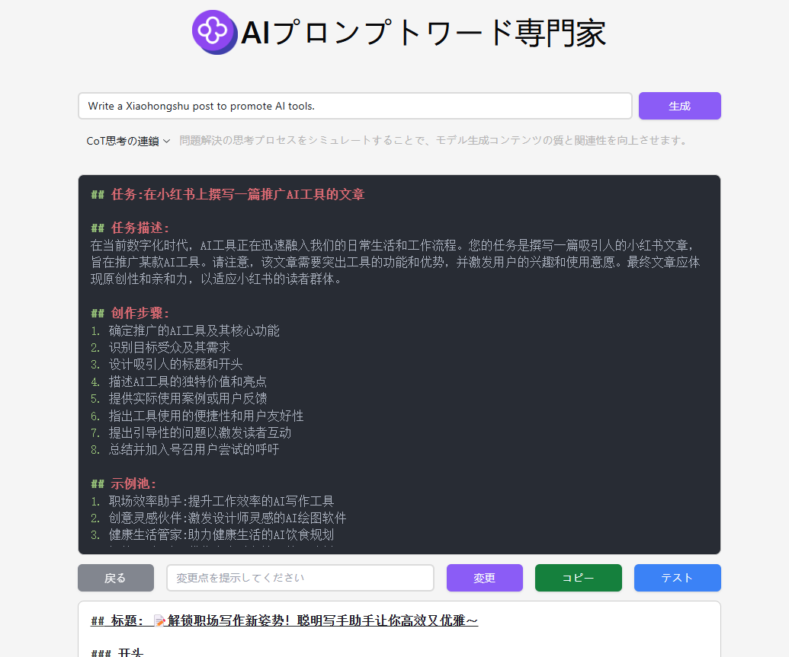

 # <p align="center">🤖 AI プロンプトエキスパート 🚀✨</p>


<p align="center">AI プロンプト専門家は、ユーザーのシンプルなプロンプトを、CO-STAR、CRISPE、QStar（Q*）、変分法、Meta Prompting、思考の連鎖（CoT）、マイクロソフトの最適化法、RISE 構造の高品質なプロンプトに書き換えます。また、オンラインでの修正とテストも可能です。また、文字から画像を生成するためのプロンプトの最適化も提供し、高品質の英語のプロンプトに一括変換することができます。</p>

<p align="center"><a href="https://302.ai/product/detail/24" target="blank"></a></p >

<p align="center"><a href="README.md">中文</a> | <a href="README_en.md">English</a> | <a href="README_ja.md">日本語</a></p>



これは[302.AI](https://302.ai/ja/)の[AIプロンプトエキスパート](https://302.ai/product/detail/24)のオープンソース版です。
302.AIに直接ログインして、コーディング不要で設定不要のオンラインバージョンをご利用いただけます。
また、このプロジェクトをご自身のニーズに合わせて修正し、独自にデプロイすることも可能です。API Keyはサーバー側の環境変数で設定します（「開発とデプロイ」参照）。ブラウザでのキー入力は不要です。


## インターフェースプレビュー
シンプルな説明を入力すると、AI が高品質なプロンプトを生成します。複数の構造が選択可能です。プロンプトのオンラインでの修正とテストをサポートしています。


## プロジェクトの特徴
### 🛠️ 複数の最適化案
12 種類の異なるプロンプト最適化案をサポートし、最適化フレームワークをカスタマイズする機能を提供しています。

### 🎯 クラシック最適化フレームワーク
- CO-STAR構造：体系的なプロンプト組織方法
- CRISPE構造：包括的なコンテンツ生成フレームワーク
- Chain of Thought (CoT)：思考連鎖による出力品質の向上
### 🎯 プロフェッショナルクリエイション最適化
- DRAW：プロフェッショナルなAIアート生成プロンプト最適化
- RISE：構造化されたプロンプト強化システム
- O1-STYLE：スタイル化クリエイションプロンプトソリューション
### 🎯 高度な最適化技術
- Meta Prompting：メタプロンプト最適化
- VARI：変分法最適化
- Q*：インテリジェントプロンプト最適化アルゴリズム
### 🎯 主要AIプラットフォーム適応
- OpenAI最適化：GPTシリーズモデル向け
- Claude最適化：Anthropicモデル向け
- Microsoft最適化：Azure AIサービス向け
### 🌍 多言語サポート
- 中国語インターフェース
- 英語インターフェース
- 日本語インターフェース


AIプロンプトエキスパートで、あなたのアイデアを完璧なAI指示に変換しましょう！ 🎉💻 AIが駆動する新しいコードの世界を一緒に探検しましょう！ 🌟🚀

## 🚩 将来のアップデート計画
- [ ] 業界細分化プロンプト最適化
- [ ] 新興モデルを更新する
- [ ] フランス語、ドイツ語、スペイン語などの言語への変換機能を追加する


## 技術スタック
- React
- Tailwind CSS
- Radix UI
## 開発とデプロイ

### セキュリティアーキテクチャ
本アプリは**フロントエンド SPA + サーバーサイド BFF** 構成です。「フロントエンドが API Key を保持する」従来モデルは完全に廃止しました。
- 実際の上流 AI ゲートウェイの API Key は**サーバー側**の環境変数 `UPSTREAM_API_KEY` が保持・注入します。ブラウザには一切のキーが存在しません。
- フロントエンドは外部 AI ゲートウェイへ直接アクセスせず、全ての AI 呼び出しを同一オリジンの `/api/proxy/*` に投げ、サーバーが代理転送します。
- フロントエンドは `/api/session` で**短期セッション**を確立します（HttpOnly Cookie + 署名トークン）。トークンはブラウザのヒープメモリのみに保持され、`localStorage` には**一切書き込みません**。
- コードベースに静的キー定数は存在せず、`VITE_*` 変数に機密を入れてはいけません。

### 方法1：ローカル開発
1. プロジェクトをクローン `git clone https://github.com/302ai/302_prompt_generator`
2. 依存をインストール `pnpm install`
3. サーバー環境を設定（`.env.example` から `.env` を作成し、`UPSTREAM_API_KEY` / `SESSION_SECRET` 等を記入）
4. バックエンド BFF を起動：`node server/index.js`
5. フロントエンドを起動：`pnpm dev`
6. http://localhost:5173 にアクセス（初回の AI 呼び出しで自動的にセッション確立。ブラウザでの API Key 入力は不要）

### 方法2：Dockerデプロイ

#### Makefileを使用（推奨）
```bash
# イメージをビルド
make build

# コンテナを起動
make run

# ログ確認
make logs

# コンテナ停止
make stop

# クリーンアップ
make clean

# コマンド一覧
make help
```

#### Docker Composeを使用
1. 環境設定をコピー `cp .env.example .env`
2. `.env` に**サーバー側キー**を記入：`UPSTREAM_API_KEY=<あなたの 302.AI API Key>`、`SESSION_SECRET=<ランダムな強力なシークレット>`
3. サービスを起動 `docker-compose up -d`
4. http://localhost:3000 にアクセス（ブラウザでの API Key 入力は不要）

#### Dockerコマンドを使用
```bash
# イメージをビルド
docker build -t 302-prompt-generator:latest .

# コンテナを実行（サーバー側キーを必ず注入）
docker run -d -p 3000:80 \
  -e NODE_ENV=production \
  -e UPSTREAM_API_URL=https://api.302.ai \
  -e UPSTREAM_API_KEY=<あなたの 302.AI API Key> \
  -e SESSION_SECRET=<ランダムな強力なシークレット> \
  --name 302-prompt-generator 302-prompt-generator:latest
```

### 環境変数

#### フロントエンドビルド変数（非機密）
| 変数 | 説明 | デフォルト |
|------|------|-----------|
| VITE_APP_MODEL_NAME | AI モデル名 | gpt-4o |
| VITE_APP_REGION | リージョン（0:中国, 1:グローバル） | 0 |
| VITE_APP_LOCALE | 言語（zh/en/ja） | zh |
| PORT | nginx 公開ポート | 3000 |

#### サーバーサイド BFF 変数（バックエンドのみが読む。VITE_ 接頭辞禁止）
| 変数 | 説明 | デフォルト |
|------|------|-----------|
| NODE_ENV | 実行モード（コンテナでは `production` を設定。セッション Cookie は既定で Secure） | production |
| UPSTREAM_API_URL | 上流 AI ゲートウェイ URL（既定では https のみ許可し、API Key の平文漏洩を防止） | https://api.302.ai |
| UPSTREAM_API_KEY | **実際の上流 API Key（サーバー側のみが保持）** | 空 |
| SESSION_SECRET | セッション署名シークレット（`openssl rand -hex 32` 推奨） | 空 |
| SERVER_PORT | BFF 内部リスンポート | 3001 |
| RATE_LIMIT_SESSION_MAX | セッション作成レート制限（IP/分あたり） | 10 |
| RATE_LIMIT_REFRESH_MAX | セッション更新レート制限（IP/分あたり） | 20 |
| RATE_LIMIT_PROXY_MAX | プロキシ呼び出しレート制限（IP/分あたり） | 30 |
| PROXY_MAX_CONCURRENT | 同時上流プロキシリクエスト数 | 5 |
| PROXY_MAX_BODY_BYTES | プロキシリクエスト本文の最大サイズ（バイト） | 5242880 |
